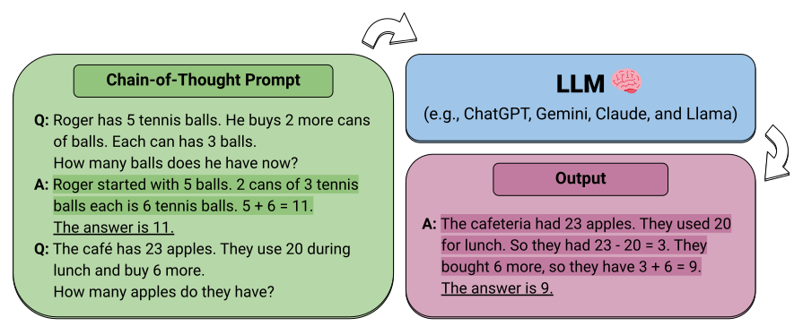

  
  
  
  

    

<h1 align="center">Awesome LLM Reasoning</h1>

    <b> Curated collection of papers and resources on how to unlock the reasoning ability of LLMs and MLLMs.</b>
    <b>This repo only Focus on reasoning enhancement methods</b>

## 2024

### Title: Training Language Models to Self-Correct via Reinforcement Learning 

#### Abstract:

Self-correction is a highly desirable capability of large language models (LLMs), yet it has consistently been found to be largely ineffective in modern LLMs. Existing approaches for training self-correction either require multiple models or rely on a more capable model or other forms of supervision. To this end, we develop a multi-turn online reinforcement learning (RL) approach, SCoRe, that significantly improves an LLM's self-correction ability using entirely self-generated data. To build SCoRe, we first show that variants of supervised fine-tuning (SFT) on offline model-generated correction traces are insufficient for instilling self-correction behavior. In particular, we observe that training via SFT either suffers from a distribution mismatch between the training data and the model's own responses or implicitly prefers only a certain mode of correction behavior that is often not effective at test time. SCoRe addresses these challenges by training under the model's own distribution of self-generated correction traces and using appropriate regularization to steer the learning process into learning a self-correction strategy that is effective at test time as opposed to simply fitting high-reward responses for a given prompt. This regularization prescribes running a first phase of RL on a base model to generate a policy initialization that is less susceptible to collapse and then using a reward bonus to amplify self-correction during training. When applied to Gemini 1.0 Pro and 1.5 Flash models, we find that SCoRe achieves state-of-the-art self-correction performance, improving the base models' self-correction by 15.6% and 9.1% respectively on the MATH and HumanEval benchmarks.

### Title: Learning to Reason with LLMs

#### Abstract:

We are introducing OpenAI o1, a new large language model trained with reinforcement learning to perform complex reasoning. o1 thinks before it answers—it can produce a long internal chain of thought before responding to the user. OpenAI o1 ranks in the 89th percentile on competitive programming questions (Codeforces), places among the top 500 students in the US in a qualifier for the USA Math Olympiad (AIME), and exceeds human PhD-level accuracy on a benchmark of physics, biology, and chemistry problems (GPQA). While the work needed to make this new model as easy to use as current models is still ongoing, we are releasing an early version of this model, OpenAI o1-preview, for immediate use in ChatGPT and to trusted API users.

Our large-scale reinforcement learning algorithm teaches the model how to think productively using its chain of thought in a highly data-efficient training process. We have found that the performance of o1 consistently improves with more reinforcement learning (train-time compute) and with more time spent thinking (test-time compute). The constraints on scaling this approach differ substantially from those of LLM pretraining, and we are continuing to investigate them.

The image shows two scatter plots comparing "o1 AIME accuracy" during training and at test time. Both charts have "pass@1 accuracy" on the y-axis and compute (log scale) on the x-axis. The dots indicate increasing accuracy with more compute time. o1 performance smoothly improves with both train-time and test-time compute.

To highlight the reasoning improvement over GPT-4o, we tested our models on a diverse set of human exams and ML benchmarks. We show that o1 significantly outperforms GPT-4o on the vast majority of these reasoning-heavy tasks. Unless otherwise specified, we evaluated o1 on the maximal test-time compute setting.

In many reasoning-heavy benchmarks, o1 rivals the performance of human experts. Recent frontier models1 do so well on MATH2 and GSM8K that these benchmarks are no longer effective at differentiating models. We evaluated math performance on AIME, an exam designed to challenge the brightest high school math students in America. On the 2024 AIME exams, GPT-4o only solved on average 12% (1.8/15) of problems. o1 averaged 74% (11.1/15) with a single sample per problem, 83% (12.5/15) with consensus among 64 samples, and 93% (13.9/15) when re-ranking 1000 samples with a learned scoring function. A score of 13.9 places it among the top 500 students nationally and above the cutoff for the USA Mathematical Olympiad.

We also evaluated o1 on GPQA diamond, a difficult intelligence benchmark which tests for expertise in chemistry, physics, and biology. In order to compare models to humans, we recruited experts with PhDs to answer GPQA-diamond questions. We found that o1 surpassed the performance of those human experts, becoming the first model to do so on this benchmark. These results do not imply that o1 is more capable than a PhD in all respects — only that the model is more proficient in solving some problems that a PhD would be expected to solve. On several other ML benchmarks, o1 improved over the state-of-the-art. With its vision perception capabilities enabled, o1 scored 78.2% on MMMU, making it the first model to be competitive with human experts. It also outperformed GPT-4o on 54 out of 57 MMLU subcategories.

Similar to how a human may think for a long time before responding to a difficult question, o1 uses a chain of thought when attempting to solve a problem. Through reinforcement learning, o1 learns to hone its chain of thought and refine the strategies it uses. It learns to recognize and correct its mistakes. It learns to break down tricky steps into simpler ones. It learns to try a different approach when the current one isn’t working. This process dramatically improves the model’s ability to reason.

We trained a model that scored 213 points and ranked in the 49th percentile in the 2024 International Olympiad in Informatics (IOI), by initializing from o1 and training to further improve programming skills. This model competed in the 2024 IOI under the same conditions as the human contestants. It had ten hours to solve six challenging algorithmic problems and was allowed 50 submissions per problem.

In addition to exams and academic benchmarks, we also evaluated human preference of o1-preview vs GPT-4o on challenging, open-ended prompts in a broad spectrum of domains. In this evaluation, human trainers were shown anonymized responses to a prompt from o1-preview and GPT-4o, and voted for which response they preferred. o1-preview is preferred to GPT-4o by a large margin in reasoning-heavy categories like data analysis, coding, and math. However, o1-preview is not preferred on some natural language tasks, suggesting that it is not well-suited for all use cases.

We believe that a hidden chain of thought presents a unique opportunity for monitoring models. Assuming it is faithful and legible, the hidden chain of thought allows us to "read the mind" of the model and understand its thought process. Therefore, after weighing multiple factors including user experience, competitive advantage, and the option to pursue the chain of thought monitoring, we have decided not to show the raw chains of thought to users. We acknowledge this decision has disadvantages. We strive to partially make up for it by teaching the model to reproduce any useful ideas from the chain of thought in the answer. For the o1 model series, we show a model-generated summary of the chain of thought.

o1 significantly advances the state-of-the-art in AI reasoning. We plan to release improved versions of this model as we continue iterating. We expect these new reasoning capabilities will improve our ability to align models to human values and principles. We believe o1 – and its successors – will unlock many new use cases for AI in science, coding, math, and related fields.

### Title: Agent Q: Advanced Reasoning and Learning for Autonomous AI Agents

#### Abstract:

Large Language Models (LLMs) have shown remarkable capabilities in natural language tasks requiring complex reasoning, yet their application in agentic, multi-step reasoning within interactive environments remains a difficult challenge. Traditional supervised pre-training on static datasets falls short in enabling autonomous agent capabilities needed to perform complex decision-making in dynamic settings like web navigation. Previous attempts to bridge this gap through supervised fine-tuning on curated expert demonstrations often suffer from compounding errors and limited exploration data, resulting in sub-optimal policy outcomes. To overcome these challenges, we propose a framework that combines guided Monte Carlo Tree Search (MCTS) search with a self-critique mechanism and iterative fine-tuning on agent interactions using an off-policy variant of the Direct Preference Optimization (DPO) algorithm. Our method allows LLM agents to learn effectively from both successful and unsuccessful trajectories, thereby improving their generalization in complex, multi-step reasoning tasks. We validate our approach in the WebShop environment—a simulated e-commerce platform where it consistently outperforms behavior cloning and reinforced fine-tuning baselines and beats average human performance when equipped with the capability to do online search. In real-world booking scenarios, our methodology boosts Llama-3 70B model's zero-shot performance from 18.6% to 81.7% success rate (a 340% relative increase) after a single day of data collection and further to 95.4% with online search. We believe this represents a substantial leap forward in the capabilities of autonomous agents, paving the way for more sophisticated and reliable decision-making in real-world settings.

### Title: DotaMath: Decomposition of Thought with Code Assistance and Self-correction for Mathematical Reasoning

#### Abstract:

Large language models (LLMs) have made impressive progress in handling simple math problems, yet they still struggle with more challenging and complex mathematical tasks. In this paper, we introduce a series of LLMs that employs the Decomposition of thought with code assistance and self-correction for mathematical reasoning, dubbed as DotaMath. DotaMath models tackle complex mathematical tasks by decomposing them into simpler logical subtasks, leveraging code to solve these subtasks, obtaining fine-grained feedback from the code interpreter, and engaging in self-reflection and correction. By annotating diverse interactive tool-use trajectories and employing query evolution on GSM8K and MATH datasets, we generate an instruction fine-tuning dataset called DotaMathQA with 574K query-response pairs. We train a series of base LLMs using imitation learning on DotaMathQA, resulting in DotaMath models that achieve remarkable performance compared to open-source LLMs across various in-domain and out-of-domain benchmarks. Notably, DotaMath-deepseek-7B showcases an outstanding performance of 64.8% on the competitive MATH dataset and 86.7% on GSM8K. Besides, DotaMath-deepseek-7B maintains strong competitiveness on a series of in-domain and out-of-domain benchmarks (Avg. 80.1%). Looking forward, we anticipate that the DotaMath paradigm will open new pathways for addressing intricate mathematical problems.

### Title: LLM-ARC: Enhancing LLMs with an Automated Reasoning Critic

#### Abstract:

We introduce LLM-ARC, a neuro-symbolic framework designed to enhance the logical reasoning capabilities of Large Language Models (LLMs), by combining them with an Automated Reasoning Critic (ARC). LLM-ARC employs an Actor-Critic method where the LLM Actor generates declarative logic programs along with tests for semantic correctness, while the Automated Reasoning Critic evaluates the code, runs the tests and provides feedback on test failures for iterative refinement. Implemented using Answer Set Programming (ASP), LLM-ARC achieves a new state-of-the-art accuracy of 88.32% on the FOLIO benchmark which tests complex logical reasoning capabilities. Our experiments demonstrate significant improvements over LLM-only baselines, highlighting the importance of logic test generation and iterative self-refinement. We achieve our best result using a fully automated self-supervised training loop where the Actor is trained on end-to-end dialog traces with Critic feedback. We discuss potential enhancements and provide a detailed error analysis, showcasing the robustness and efficacy of LLM-ARC for complex natural language reasoning tasks.

### Title: Q*: Improving Multi-step Reasoning for LLMs with Deliberative Planning

#### Abstract:

Large Language Models (LLMs) have demonstrated impressive capability in many natural language tasks. However, the auto-regressive generation process makes LLMs prone to produce errors, hallucinations, and inconsistent statements when performing multi-step reasoning. In this paper, by casting multi-step reasoning of LLMs as a heuristic search problem, we aim to alleviate the pathology by introducing Q*, a general, versatile, and agile framework for guiding LLMs decoding process with deliberative planning. By learning a plug-and-play Q-value model as a heuristic function for estimating expected future rewards, our Q* can effectively guide LLMs to select the most promising next reasoning step without fine-tuning LLMs for the current task, which avoids the significant computational overhead and potential risk of performance degeneration on other tasks. Extensive experiments on GSM8K, MATH, and MBPP demonstrate the superiority of our method, contributing to improving the reasoning performance of existing open-source LLMs.

### Title: Buffer of Thoughts: Thought-Augmented Reasoning with Large Language Models

#### Abstract:

We introduce Buffer of Thoughts (BoT), a novel and versatile thought-augmented reasoning approach for enhancing accuracy, efficiency, and robustness of large language models (LLMs). Specifically, we propose meta-buffer to store a series of informative high-level thoughts, namely thought-template, distilled from the problem-solving processes across various tasks. Then for each problem, we retrieve a relevant thought-template and adaptively instantiate it with specific reasoning structures to conduct efficient reasoning. To guarantee the scalability and stability, we further propose buffer-manager to dynamically update the meta-buffer, thus enhancing the capacity of the meta-buffer as more tasks are solved. We conduct extensive experiments on 10 challenging reasoning-intensive tasks and achieve significant performance improvements over previous SOTA methods: 11% on Game of 24, 20% on Geometric Shapes, and 51% on Checkmate-in-One. Further analysis demonstrates the superior generalization ability and model robustness of our BoT, while requiring only 12% of the cost of multi-query prompting methods (e.g., tree/graph of thoughts) on average. Notably, we find that our Llama3-8B+BoT has the potential to surpass the Llama3-70B model. Our project is available at: [this URL](https://arxiv.org/abs/2406.04271)

### Title: Toward Self-Improvement of LLMs via Imagination, Searching, and Criticizing

#### Abstract:

Despite the impressive capabilities of Large Language Models (LLMs) on various tasks, they still struggle with scenarios that involve complex reasoning and planning. Recent work proposed advanced prompting techniques and the necessity of fine-tuning with high-quality data to augment LLMs' reasoning abilities. However, these approaches are inherently constrained by data availability and quality. In light of this, self-correction and self-learning emerge as viable solutions, employing strategies that allow LLMs to refine their outputs and learn from self-assessed rewards. Yet, the efficacy of LLMs in self-refining its response, particularly in complex reasoning and planning tasks, remains dubious. In this paper, we introduce AlphaLLM for the self-improvement of LLMs, which integrates Monte Carlo Tree Search (MCTS) with LLMs to establish a self-improving loop, thereby enhancing the capabilities of LLMs without additional annotations. Drawing inspiration from the success of AlphaGo, AlphaLLM addresses the unique challenges of combining MCTS with LLM for self-improvement, including data scarcity, the vastness search spaces of language tasks, and the subjective nature of feedback in language tasks. AlphaLLM is comprised of a prompt synthesis component, an efficient MCTS approach tailored for language tasks, and a trio of critic models for precise feedback. Our experimental results in mathematical reasoning tasks demonstrate that AlphaLLM significantly enhances the performance of LLMs without additional annotations, showing the potential for self-improvement in LLMs.

### Title: Self-playing Adversarial Language Game Enhances LLM Reasoning

#### Abstract:

We explore the self-play training procedure of large language models (LLMs) in a two-player adversarial language game called Adversarial Taboo. In this game, an attacker and a defender communicate around a target word only visible to the attacker. The attacker aims to induce the defender to speak the target word unconsciously, while the defender tries to infer the target word from the attacker's utterances. To win the game, both players should have sufficient knowledge about the target word and high-level reasoning ability to infer and express in this information-reserved conversation. Hence, we are curious about whether LLMs' reasoning ability can be further enhanced by self-play in this adversarial language game (SPAG). With this goal, we select several open-source LLMs and let each act as the attacker and play with a copy of itself as the defender on an extensive range of target words. Through reinforcement learning on the game outcomes, we observe that the LLMs' performances uniformly improve on a broad range of reasoning benchmarks. Furthermore, iteratively adopting this self-play process can continuously promote LLMs' reasoning abilities. The code is available at the provided URL.

### Title: Evaluating Mathematical Reasoning Beyond Accuracy

#### Abstract:

The leaderboard of Large Language Models (LLMs) in mathematical tasks has been continuously updated. However, the majority of evaluations focus solely on the final results, neglecting the quality of the intermediate steps. This oversight can mask underlying problems, such as logical errors or unnecessary steps in the reasoning process. To measure reasoning beyond final-answer accuracy, we introduce ReasonEval, a new methodology for evaluating the quality of reasoning steps. ReasonEval employs \textit{validity} and to characterize the reasoning quality, as well as accompanying LLMs to assess them automatically. Instantiated by base models that possess strong mathematical knowledge and trained with high-quality labeled data, ReasonEval achieves state-of-the-art performance on human-labeled datasets and can accurately detect different types of errors generated by perturbation. When applied to evaluate LLMs specialized in math, we find that an increase in final-answer accuracy does not necessarily guarantee an improvement in the overall quality of the reasoning steps for challenging mathematical problems. Additionally, we observe that ReasonEval can play a significant role in data selection. We release the best-performing model, meta-evaluation script, and all evaluation results at this https URL.

### Title: Advancing LLM Reasoning Generalists with Preference Trees

#### Abstract:

We introduce Eurus, a suite of large language models (LLMs) optimized for reasoning. Finetuned from Mistral-7B and CodeLlama-70B, Eurus models achieve state-of-the-art results among open-source models on a diverse set of benchmarks covering mathematics, code generation, and logical reasoning problems. Notably, Eurus-70B beats GPT-3.5 Turbo in reasoning through a comprehensive benchmarking across 12 tests covering five tasks, and achieves a 33.3% pass@1 accuracy on LeetCode and 32.6% on TheoremQA, two challenging benchmarks, substantially outperforming existing open-source models by margins more than 13.3%. The strong performance of Eurus can be primarily attributed to UltraInteract, our newly-curated large-scale, high-quality alignment dataset specifically designed for complex reasoning tasks. UltraInteract can be used in both supervised fine-tuning and preference learning. For each instruction, it includes a preference tree consisting of (1) reasoning chains with diverse planning strategies in a unified format, (2) multi-turn interaction trajectories with the environment and the critique, and (3) pairwise data to facilitate preference learning. UltraInteract allows us to conduct an in-depth exploration of preference learning for reasoning tasks. Our investigation reveals that some well-established preference learning algorithms may be less suitable for reasoning tasks compared to their effectiveness in general conversations. Inspired by this, we derive a novel reward modeling objective which, together with UltraInteract, leads to a strong reward model.

### Title: LLM3: Large Language Model-based Task and Motion Planning with Motion Failure Reasoning

#### Abstract:

Conventional Task and Motion Planning (TAMP) approaches rely on manually crafted interfaces connecting symbolic task planning with continuous motion generation. These domain-specific and labor-intensive modules are limited in addressing emerging tasks in real-world settings. Here, we present LLM^3, a novel Large Language Model (LLM)-based TAMP framework featuring a domain-independent interface. Specifically, we leverage the powerful reasoning and planning capabilities of pre-trained LLMs to propose symbolic action sequences and select continuous action parameters for motion planning. Crucially, LLM^3 incorporates motion planning feedback through prompting, allowing the LLM to iteratively refine its proposals by reasoning about motion failure. Consequently, LLM^3 interfaces between task planning and motion planning, alleviating the intricate design process of handling domain-specific messages between them. Through a series of simulations in a box-packing domain, we quantitatively demonstrate the effectiveness of LLM^3 in solving TAMP problems and the efficiency in selecting action parameters. Ablation studies underscore the significant contribution of motion failure reasoning to the success of LLM^3. Furthermore, we conduct qualitative experiments on a physical manipulator, demonstrating the practical applicability of our approach in real-world settings.

### Title: Quiet-STaR: Language Models Can Teach Themselves to Think Before Speaking

#### Abstract:

When writing and talking, people sometimes pause to think. Although reasoning-focused works have often framed reasoning as a method of answering questions or completing agentic tasks, reasoning is implicit in almost all written text. For example, this applies to the steps not stated between the lines of a proof or to the theory of mind underlying a conversation. In the Self-Taught Reasoner (STaR, Zelikman et al. 2022), useful thinking is learned by inferring rationales from few-shot examples in question-answering and learning from those that lead to a correct answer. This is a highly constrained setting -- ideally, a language model could instead learn to infer unstated rationales in arbitrary text. We present Quiet-STaR, a generalization of STaR in which LMs learn to generate rationales at each token to explain future text, improving their predictions. We address key challenges, including 1) the computational cost of generating continuations, 2) the fact that the LM does not initially know how to generate or use internal thoughts, and 3) the need to predict beyond individual next tokens. To resolve these, we propose a tokenwise parallel sampling algorithm, using learnable tokens indicating a thought's start and end, and an extended teacher-forcing technique. Encouragingly, generated rationales disproportionately help model difficult-to-predict tokens and improve the LM's ability to directly answer difficult questions. In particular, after continued pretraining of an LM on a corpus of internet text with Quiet-STaR, we find zero-shot improvements on GSM8K (5.9% → 10.9%) and CommonsenseQA (36.3% → 47.2%) and observe a perplexity improvement of difficult tokens in natural text. Crucially, these improvements require no fine-tuning on these tasks. Quiet-STaR marks a step towards LMs that can learn to reason in a more general and scalable way.

### Title: GLoRe: When, Where, and How to Improve LLM Reasoning via Global and Local Refinements

#### Abstract:

State-of-the-art language models can exhibit impressive reasoning refinement capabilities on math, science or coding tasks. However, recent work demonstrates that even the best models struggle to identify \textit{when and where to refine} without access to external feedback. Outcome-based Reward Models (\textbf{ORMs}), trained to predict correctness of the final answer indicating when to refine, offer one convenient solution for deciding when to refine. Process Based Reward Models (\textbf{PRMs}), trained to predict correctness of intermediate steps, can then be used to indicate where to refine. But they are expensive to train, requiring extensive human annotations. In this paper, we propose Stepwise ORMs (\textbf{SORMs}) which are trained, only on synthetic data, to approximate the expected future reward of the optimal policy or V^{\star} . More specifically, SORMs are trained to predict the correctness of the final answer when sampling the current policy many times (rather than only once as in the case of ORMs). Our experiments show that SORMs can more accurately detect incorrect reasoning steps compared to ORMs, thus improving downstream accuracy when doing refinements. We then train \textit{global} refinement models, which take only the question and a draft solution as input and predict a corrected solution, and \textit{local} refinement models which also take as input a critique indicating the location of the first reasoning error. We generate training data for both models synthetically by reusing data used to train the SORM. We find combining global and local refinements, using the ORM as a reranker, significantly outperforms either one individually, as well as a best of three sample baseline. With this strategy we can improve the accuracy of a LLaMA-2 13B model (already fine-tuned with RL) on GSM8K from 53\% to 65\% when greedily sampled.

### Title: Chain-of-Thought Reasoning Without Prompting

#### Abstract:

In enhancing the reasoning capabilities of large language models (LLMs), prior research primarily focuses on specific prompting techniques such as few-shot or zero-shot chain-of-thought (CoT) prompting. These methods, while effective, often involve manually intensive prompt engineering. Our study takes a novel approach by asking: Can LLMs reason effectively without prompting? Our findings reveal that, intriguingly, CoT reasoning paths can be elicited from pre-trained LLMs by simply altering the decoding process. Rather than conventional greedy decoding, we investigate the top- k alternative tokens, uncovering that CoT paths are frequently inherent in these sequences. This approach not only bypasses the confounders of prompting but also allows us to assess the LLMs' intrinsic reasoning abilities. Moreover, we observe that the presence of a CoT in the decoding path correlates with a higher confidence in the model's decoded answer. This confidence metric effectively differentiates between CoT and non-CoT paths. Extensive empirical studies on various reasoning benchmarks show that the proposed CoT-decoding effectively elicits reasoning capabilities from language models, which were previously obscured by standard greedy decoding.

### Title: V-STaR: Training Verifiers for Self-Taught Reasoners

#### Abstract:

Common self-improvement approaches for large language models (LLMs), such as STaR (Zelikman et al., 2022), iteratively fine-tune LLMs on self-generated solutions to improve their problem-solving ability. However, these approaches discard the large amounts of incorrect solutions generated during this process, potentially neglecting valuable information in such solutions. To address this shortcoming, we propose V-STaR that utilizes both the correct and incorrect solutions generated during the self-improvement process to train a verifier using DPO that judges correctness of model-generated solutions. This verifier is used at inference time to select one solution among many candidate solutions. Running V-STaR for multiple iterations results in progressively better reasoners and verifiers, delivering a 4% to 17% test accuracy improvement over existing self-improvement and verification approaches on common code generation and math reasoning benchmarks with LLaMA2 models.

### Title: InternLM-Math: Open Math Large Language Models Toward Verifiable Reasoning

#### Abstract:

The math abilities of large language models can represent their abstract reasoning ability. In this paper, we introduce and open-source our math reasoning LLMs InternLM-Math which is continue pre-trained from InternLM2. We unify chain-of-thought reasoning, reward modeling, formal reasoning, data augmentation, and code interpreter in a unified seq2seq format and supervise our model to be a versatile math reasoner, verifier, prover, and augmenter. These abilities can be used to develop the next math LLMs or self-iteration. InternLM-Math obtains open-sourced state-of-the-art performance under the setting of in-context learning, supervised fine-tuning, and code-assisted reasoning in various informal and formal benchmarks including GSM8K, MATH, Hungary math exam, MathBench-ZH, and MiniF2F. Our pre-trained model achieves 30.3 on the MiniF2F test set without fine-tuning. We further explore how to use LEAN to solve math problems and study its performance under the setting of multi-task learning which shows the possibility of using LEAN as a unified platform for solving and proving in math. Our models, codes, and data are released at [this URL](https://doi.org/10.48550/arXiv.2402.06332).

### Title: Self-Discover: Large Language Models Self-Compose Reasoning Structures

#### Abstract:

We introduce SELF-DISCOVER, a general framework for LLMs to self-discover the task-intrinsic reasoning structures to tackle complex reasoning problems that are challenging for typical prompting methods. Core to the framework is a self-discovery process where LLMs select multiple atomic reasoning modules such as critical thinking and step-by-step thinking, and compose them into an explicit reasoning structure for LLMs to follow during decoding. SELF-DISCOVER substantially improves GPT-4 and PaLM 2's performance on challenging reasoning benchmarks such as BigBench-Hard, grounded agent reasoning, and MATH, by as much as 32% compared to Chain of Thought (CoT). Furthermore, SELF-DISCOVER outperforms inference-intensive methods such as CoT-Self-Consistency by more than 20%, while requiring 10-40x fewer inference compute. Finally, we show that the self-discovered reasoning structures are universally applicable across model families: from PaLM 2-L to GPT-4, and from GPT-4 to Llama2, and share commonalities with human reasoning patterns.

### Title: DeepSeekMath: Pushing the Limits of Mathematical Reasoning in Open Language Models

#### Abstract:

Mathematical reasoning poses a significant challenge for language models due to its complex and structured nature. In this paper, we introduce DeepSeekMath 7B, which continues pre-training DeepSeek-Coder-Base-v1.5 7B with 120B math-related tokens sourced from Common Crawl, together with natural language and code data. DeepSeekMath 7B has achieved an impressive score of 51.7% on the competition-level MATH benchmark without relying on external toolkits and voting techniques, approaching the performance level of Gemini-Ultra and GPT-4. Self-consistency over 64 samples from DeepSeekMath 7B achieves 60.9% on MATH. The mathematical reasoning capability of DeepSeekMath is attributed to two key factors: First, we harness the significant potential of publicly available web data through a meticulously engineered data selection pipeline. Second, we introduce Group Relative Policy Optimization (GRPO), a variant of Proximal Policy Optimization (PPO), that enhances mathematical reasoning abilities while concurrently optimizing the memory usage of PPO.

### Title: K-Level Reasoning with Large Language Models

#### Abstract:

This paper introduces the concept of K-Level Reasoning with Large Language Models. The authors propose a methodology to enhance the reasoning capabilities of language models by incorporating K-level reasoning, which involves reasoning over multiple levels of abstraction. They demonstrate the effectiveness of this approach in improving the performance of language models on various reasoning tasks. The paper provides insights into the potential of K-Level Reasoning for advancing the capabilities of large language models.

### Title: Efficient Tool Use with Chain-of-Abstraction Reasoning

#### Abstract:

To achieve faithful reasoning that aligns with human expectations, large language models (LLMs) need to ground their reasoning to real-world knowledge (e.g., web facts, math and physical rules). Tools help LLMs access this external knowledge, but there remains challenges for fine-tuning LLM agents (e.g., Toolformer) to invoke tools in multi-step reasoning problems, where inter-connected tool calls require holistic and efficient tool usage planning.

In this work, we propose a new method for LLMs to better leverage tools in multi-step reasoning. Our method, Chain-of-Abstraction (CoA), trains LLMs to first decode reasoning chains with abstract placeholders, and then call domain tools to reify each reasoning chain by filling in specific knowledge. This planning with abstract chains enables LLMs to learn more general reasoning strategies, which are robust to shifts of domain knowledge (e.g., math results) relevant to different reasoning questions. It also allows LLMs to perform decoding and calling of external tools in parallel, which avoids the inference delay caused by waiting for tool responses. In mathematical reasoning and Wiki QA domains, we show that our method consistently outperforms previous chain-of-thought and tool-augmented baselines on both in-distribution and out-of-distribution test sets, with an average ~6% absolute QA accuracy improvement. LLM agents trained with our method also show more efficient tool use, with inference speed being on average ~1.4x faster than baseline tool-augmented LLMs.

### Title: Teaching Language Models to Self-Improve through Interactive Demonstrations

#### Abstract:

The self-improving ability of large language models (LLMs), enabled by prompting them to analyze and revise their own outputs, has garnered significant interest in recent research. However, this ability has been shown to be absent and difficult to learn for smaller models, thus widening the performance gap between state-of-the-art LLMs and more cost-effective and faster ones. To reduce this gap, we introduce TriPosT, a training algorithm that endows smaller models with such self-improvement ability, and show that our approach can improve a LLaMA-7b's performance on math and reasoning tasks by up to 7.13%. In contrast to prior work, we achieve this by using the smaller model to interact with LLMs to collect feedback and improvements on its own generations. We then replay this experience to train the small model. Our experiments on four math and reasoning datasets show that the interactive experience of learning from and correcting its own mistakes is crucial for small models to improve their performance.

### Title: Enhancing Zero-Shot Chain-of-Thought Reasoning in Large Language Models through Logic

#### Abstract:

Recent advancements in large language models have showcased their remarkable generalizability across various domains. However, their reasoning abilities still have significant room for improvement, especially when confronted with scenarios requiring multi-step reasoning. Although large language models possess extensive knowledge, their behavior, particularly in terms of reasoning, often fails to effectively utilize this knowledge to establish a coherent thinking paradigm. Generative language models sometimes show hallucinations as their reasoning procedures are unconstrained by logical principles. Aiming to improve the zero-shot chain-of-thought reasoning ability of large language models, we propose Logical Chain-of-Thought (LogiCoT), a neurosymbolic framework that leverages principles from symbolic logic to verify and revise the reasoning processes accordingly. Experimental evaluations conducted on language tasks in diverse domains, including arithmetic, commonsense, symbolic, causal inference, and social problems, demonstrate the efficacy of the enhanced reasoning paradigm by logic.

Please note that the output has been formatted as per your request.

### Title: Chain-of-Verification Reduces Hallucination in Large Language Models

#### Abstract:

Generation of plausible yet incorrect factual information, termed hallucination, is an unsolved issue in large language models. We study the ability of language models to deliberate on the responses they give in order to correct their mistakes. We develop the Chain-of-Verification (CoVe) method whereby the model first (i) drafts an initial response; then (ii) plans verification questions to fact-check its draft; (iii) answers those questions independently so the answers are not biased by other responses; and (iv) generates its final verified response. In experiments, we show CoVe decreases hallucinations across a variety of tasks, from list-based questions from Wikidata, closed book MultiSpanQA and longform text generation.

Please let me know if there's anything else I can help you with!

### Title: Skeleton-of-Thought: Large Language Models Can Do Parallel Decoding

#### Abstract:

This work aims at decreasing the end-to-end generation latency of large language models (LLMs). One of the major causes of the high generation latency is the sequential decoding approach adopted by almost all state-of-the-art LLMs. In this work, motivated by the thinking and writing process of humans, we propose "Skeleton-of-Thought" (SoT), which guides LLMs to first generate the skeleton of the answer, and then conducts parallel API calls or batched decoding to complete the contents of each skeleton point in parallel. Not only does SoT provide considerable speed-up (up to 2.39x across 11 different LLMs), but it can also potentially improve the answer quality on several question categories in terms of diversity and relevance. SoT is an initial attempt at data-centric optimization for efficiency, and reveal the potential of pushing LLMs to think more like a human for answer quality.

### Title: Question Decomposition Improves the Faithfulness of Model-Generated Reasoning

#### Abstract:

As large language models (LLMs) perform more difficult tasks, it becomes harder to verify the correctness and safety of their behavior. One approach to help with this issue is to prompt LLMs to externalize their reasoning, e.g., by having them generate step-by-step reasoning as they answer a question (Chain-of-Thought; CoT). The reasoning may enable us to check the process that models use to perform tasks. However, this approach relies on the stated reasoning faithfully reflecting the model's actual reasoning, which is not always the case. To improve over the faithfulness of CoT reasoning, we have models generate reasoning by decomposing questions into subquestions. Decomposition-based methods achieve strong performance on question-answering tasks, sometimes approaching that of CoT while improving the faithfulness of the model's stated reasoning on several recently-proposed metrics. By forcing the model to answer simpler subquestions in separate contexts, we greatly increase the faithfulness of model-generated reasoning over CoT, while still achieving some of the performance gains of CoT. Our results show it is possible to improve the faithfulness of model-generated reasoning; continued improvements may lead to reasoning that enables us to verify the correctness and safety of LLM behavior.

### Title: Let's Verify Step by Step

#### Abstract:

In recent years, large language models have greatly improved in their ability to perform complex multi-step reasoning. However, even state-of-the-art models still regularly produce logical mistakes. To train more reliable models, we can turn either to outcome supervision, which provides feedback for a final result, or process supervision, which provides feedback for each intermediate reasoning step. Given the importance of training reliable models, and given the high cost of human feedback, it is important to carefully compare the both methods. Recent work has already begun this comparison, but many questions still remain. We conduct our own investigation, finding that process supervision significantly outperforms outcome supervision for training models to solve problems from the challenging MATH dataset. Our process-supervised model solves 78% of problems from a representative subset of the MATH test set. Additionally, we show that active learning significantly improves the efficacy of process supervision. To support related research, we also release PRM800K, the complete dataset of 800,000 step-level human feedback labels used to train our best reward model.

### Title: REFINER: Reasoning Feedback on Intermediate Representations

#### Abstract:

Language models (LMs) have recently shown remarkable performance on reasoning tasks by explicitly generating intermediate inferences, e.g., chain-of-thought prompting. However, these intermediate inference steps may be inappropriate deductions from the initial context and lead to incorrect final predictions. Here we introduce REFINER, a framework for finetuning LMs to explicitly generate intermediate reasoning steps while interacting with a critic model that provides automated feedback on the reasoning. Specifically, the critic provides structured feedback that the reasoning LM uses to iteratively improve its intermediate arguments. Empirical evaluations of REFINER on three diverse reasoning tasks show significant improvements over baseline LMs of comparable scale. Furthermore, when using GPT3.5 as the reasoner, the trained critic significantly improves reasoning without finetuning the reasoner. Finally, our critic model is trained without expensive human-in-the-loop data but can be substituted with humans at inference time.

### Title: Active Prompting with Chain-of-Thought for Large Language Models

#### Abstract:

The increasing scale of large language models (LLMs) brings emergent abilities to various complex tasks requiring reasoning, such as arithmetic and commonsense reasoning. It is known that the effective design of task-specific prompts is critical for LLMs' ability to produce high-quality answers. In particular, an effective approach for complex question-and-answer tasks is example-based prompting with chain-of-thought (CoT) reasoning, which significantly improves the performance of LLMs. However, current CoT methods rely on a fixed set of human-annotated exemplars, which are not necessarily the most effective examples for different tasks. This paper proposes a new method, Active-Prompt, to adapt LLMs to different tasks with task-specific example prompts (annotated with human-designed CoT reasoning). For this purpose, we propose a solution to the key problem of determining which questions are the most important and helpful ones to annotate from a pool of task-specific queries. By borrowing ideas from the related problem of uncertainty-based active learning, we introduce several metrics to characterize the uncertainty so as to select the most uncertain questions for annotation. Experimental results demonstrate the superiority of our proposed method, achieving state-of-the-art on eight complex reasoning tasks. Further analyses of different uncertainty metrics, pool sizes, zero-shot learning, and accuracy-uncertainty relationship demonstrate the effectiveness of our method. Our code will be available at this [URL](https://doi.org/10.48550/arXiv.2302.12246).

### Title: Language Models as Inductive Reasoners

#### Abstract:

Inductive reasoning is a core component of human intelligence. In the past research of inductive reasoning within computer science, logic language is used as representations of knowledge (facts and rules, more specifically). However, logic language can cause systematic problems for inductive reasoning such as disability of handling raw input such as natural language, sensitiveness to mislabeled data, and incapacity to handle ambiguous input. To this end, we propose a new task, which is to induce natural language rules from natural language facts, and create a dataset termed DEER containing 1.2k rule-fact pairs for the task, where rules and facts are written in natural language. New automatic metrics are also proposed and analysed for the evaluation of this task. With DEER, we investigate a modern approach for inductive reasoning where we use natural language as representation for knowledge instead of logic language and use pretrained language models as ''reasoners''. Moreover, we provide the first and comprehensive analysis of how well pretrained language models can induce natural language rules from natural language facts. We also propose a new framework drawing insights from philosophy literature for this task, which we show in the experiment section that surpasses baselines in both automatic and human evaluations.

## 2023

### Title: Boosting LLM Reasoning: Push the Limits of Few-shot Learning with Reinforced In-Context Pruning

#### Abstract: 
Large language models (LLMs) have shown impressive capabilities in various tasks, yet they still struggle with math reasoning. Despite efforts to optimize Chain-of-Thoughts (CoT) prompts and fine-tune LLMs, the potential of few-shot learning remains unexplored. In this work, we propose CoT-Max, a novel approach pushing the boundaries of few-shot CoT learning to improve LLM math reasoning capabilities. CoT-Max addresses the challenges of the selection of useful examples and limited number of examples due to restricted context window length. Inspired by our observation that natural language inputs contain many redundancy, we propose a coarse-to-fine pruner as a plug-and-play module for LLMs, which first identifies crucial CoT examples from a large batch and then further prunes unimportant tokens. To train the pruner, we collect a math reasoning dataset with diverse difficulty and steps, introduce a reward to measure both the input's effectiveness for math reasoning and token length constraints, and propose a novel training approach with reinforcement learning. As a result, CoT-Max significantly outperforms CoT and few-shot prompting baselines across various LLMs (LLaMA2-7B, 13B, 70B) and 5 mathematical datasets, achieving up to 4.55% absolute improvements. Remarkably, without any fine-tuning, LLaMA2-70B with CoT-Max surpasses GPT-3.5 and a wide range of larger LLMs (PaLM, Minerva, etc.) on the GSM8K.

### Title: Logic-LM: Empowering Large Language Models with Symbolic Solvers for Faithful Logical Reasoning

#### Abstract:

Large Language Models (LLMs) have shown human-like reasoning abilities but still struggle with complex logical problems. This paper introduces a novel framework, Logic-LM, which integrates LLMs with symbolic reasoning to improve logical problem-solving. Our method first utilizes LLMs to translate a natural language problem into a symbolic formulation. Afterward, a deterministic symbolic solver performs inference on the formulated problem. We also introduce a self-refinement stage, which utilizes the symbolic solver's error messages to revise symbolic formalizations. We demonstrate Logic-LM's effectiveness on four logical reasoning datasets: ProofWriter, PrOntoQA, FOLIO, and LogicalDeduction. Our results show significant improvement compared to LLMs alone, with an average performance boost of 62.6% over standard prompting and 23.5% over chain-of-thought prompting. Our findings suggest that Logic-LM, by combining LLMs with symbolic logic, offers a promising avenue for faithful logical reasoning. Code and data are publicly available at this https URL.

### Title: Recursion of Thought: A Divide-and-Conquer Approach to Multi-Context Reasoning with Language Models

#### Abstract:

Generating intermediate steps, or Chain of Thought (CoT), is an effective way to significantly improve language models' (LM) multi-step reasoning capability. However, the CoT lengths can grow rapidly with the problem complexity, easily exceeding the maximum context size. Instead of increasing the context limit, which has already been heavily investigated, we explore an orthogonal direction: making LMs divide a problem into multiple contexts. We propose a new inference framework, called Recursion of Thought (RoT), which introduces several special tokens that the models can output to trigger context-related operations. Extensive experiments with multiple architectures including GPT-3 show that RoT dramatically improves LMs' inference capability to solve problems, whose solution consists of hundreds of thousands of tokens.

### Title: Reasoning with Language Model is Planning with World Model

#### Abstract:

Large language models (LLMs) have shown remarkable reasoning capabilities, especially when prompted to generate intermediate reasoning steps (e.g., Chain-of-Thought, CoT). However, LLMs can still struggle with problems that are easy for humans, such as generating action plans for executing tasks in a given environment, or performing complex math, logical, and commonsense reasoning. The deficiency stems from the key fact that LLMs lack an internal \textit{world model} to predict the world \textit{state} (e.g., environment status, intermediate variable values) and simulate long-term outcomes of actions. This prevents LLMs from performing deliberate planning akin to human brains, which involves exploring alternative reasoning paths, anticipating future states and rewards, and iteratively refining existing reasoning steps. To overcome the limitations, we propose a new LLM reasoning framework, RAP (Reasoning via Planning). RAP repurposes the LLM as both a world model and a reasoning agent, and incorporates a principled planning algorithm (based on Monto Carlo Tree Search) for strategic exploration in the vast reasoning space. During reasoning, the LLM (as agent) incrementally builds a reasoning tree under the guidance of the LLM (as world model) and task-specific rewards, and obtains a high-reward reasoning path efficiently with a proper balance between exploration vs. exploitation. We apply RAP to a variety of challenging reasoning problems including plan generation, math reasoning, and logical inference. Empirical results on these tasks demonstrate the superiority of RAP over various strong baselines, including CoT and least-to-most prompting with self-consistency. RAP on LLAMA-33B surpasses CoT on GPT-4 with 33% relative improvement in a plan generation setting.

### Title: Reasoning Implicit Sentiment with Chain-of-Thought Prompting

#### Abstract:

While sentiment analysis systems try to determine the sentiment polarities of given targets based on the key opinion expressions in input texts, in implicit sentiment analysis (ISA) the opinion cues come in an implicit and obscure manner. Thus detecting implicit sentiment requires the common-sense and multi-hop reasoning ability to infer the latent intent of opinion. Inspired by the recent chain-of-thought (CoT) idea, in this work we introduce a Three-hop Reasoning (THOR) CoT framework to mimic the human-like reasoning process for ISA. We design a three-step prompting principle for THOR to step-by-step induce the implicit aspect, opinion, and finally the sentiment polarity. Our THOR+Flan-T5 (11B) pushes the state-of-the-art (SoTA) by over 6% F1 on supervised setup. More strikingly, THOR+GPT3 (175B) boosts the SoTA by over 50% F1 on zero-shot setting. Our code is at this https URL.

### Title: Tree of Thoughts: Deliberate Problem Solving with Large Language Models

#### Abstract:

Language models are increasingly being deployed for general problem solving across a wide range of tasks, but are still confined to token-level, left-to-right decision-making processes during inference. This means they can fall short in tasks that require exploration, strategic lookahead, or where initial decisions play a pivotal role. To surmount these challenges, we introduce a new framework for language model inference, Tree of Thoughts (ToT), which generalizes over the popular Chain of Thought approach to prompting language models, and enables exploration over coherent units of text (thoughts) that serve as intermediate steps toward problem solving. ToT allows LMs to perform deliberate decision making by considering multiple different reasoning paths and self-evaluating choices to decide the next course of action, as well as looking ahead or backtracking when necessary to make global choices. Our experiments show that ToT significantly enhances language models' problem-solving abilities on three novel tasks requiring non-trivial planning or search: Game of 24, Creative Writing, and Mini Crosswords. For instance, in Game of 24, while GPT-4 with chain-of-thought prompting only solved 4% of tasks, our method achieved a success rate of 74%. Code repo with all prompts: [this GitHub URL](https://github.com/...).

Please note that the information provided is based on the given paragraph and may not include all details from the original paper.

### Title: SatLM: Satisfiability-Aided Language Models Using Declarative Prompting

#### Abstract:

Prior work has combined chain-of-thought prompting in large language models (LLMs) with programmatic representations to perform effective and transparent reasoning. While such an approach works well for tasks that only require forward reasoning (e.g., straightforward arithmetic), it is less effective for constraint solving problems that require more sophisticated planning and search. In this paper, we propose a new satisfiability-aided language modeling (SatLM) approach for improving the reasoning capabilities of LLMs. We use an LLM to generate a declarative task specification rather than an imperative program and leverage an off-the-shelf automated theorem prover to derive the final answer. This approach has two key advantages. The declarative specification is closer to the problem description than the reasoning steps are, so the LLM can parse it out of the description more accurately. Furthermore, by offloading the actual reasoning task to an automated theorem prover, our approach can guarantee the correctness of the answer with respect to the parsed specification and avoid planning errors in the solving process. We evaluate SATLM on 8 different datasets and show that it consistently outperforms program-aided LMs in the imperative paradigm. In particular, SATLM outperforms program-aided LMs by 23% on a challenging subset of the GSM arithmetic reasoning dataset; SATLM also achieves a new SoTA on LSAT and BoardgameQA, surpassing previous models that are trained on the respective training sets.

### Title: ART: Automatic multi-step reasoning and tool-use for large language models

#### Abstract:

Large language models (LLMs) can perform complex reasoning in few- and zero-shot settings by generating intermediate chain of thought (CoT) reasoning steps. Further, each reasoning step can rely on external tools to support computation beyond the core LLM capabilities (e.g. search/running code). Prior work on CoT prompting and tool use typically requires hand-crafting task-specific demonstrations and carefully scripted interleaving of model generations with tool use. We introduce Automatic Reasoning and Tool-use (ART), a framework that uses frozen LLMs to automatically generate intermediate reasoning steps as a program. Given a new task to solve, ART selects demonstrations of multi-step reasoning and tool use from a task library. At test time, ART seamlessly pauses generation whenever external tools are called, and integrates their output before resuming generation. ART achieves a substantial improvement over few-shot prompting and automatic CoT on unseen tasks in the BigBench and MMLU benchmarks, and matches performance of hand-crafted CoT prompts on a majority of these tasks. ART is also extensible, and makes it easy for humans to improve performance by correcting errors in task-specific programs or incorporating new tools, which we demonstrate by drastically improving performance on select tasks with minimal human intervention.

### Title: Automatic Prompt Augmentation and Selection with Chain-of-Thought from Labeled Data

#### Abstract:

Chain-of-thought prompting (CoT) advances the reasoning abilities of large language models (LLMs) and achieves superior performance in arithmetic, commonsense, and symbolic reasoning tasks. However, most CoT studies rely on carefully designed human-annotated rational chains to prompt the language model, which poses challenges for real-world applications where labeled training data is available without human-annotated rational chains. This creates barriers to applications of CoT prompting to these general tasks. This paper proposes a new strategy, Automate-CoT (Automatic Prompt Augmentation and Selection with Chain-of-Thought), that can bypass human engineering of CoTs by automatically augmenting rational chains from a small labeled dataset, and then pruning low-quality chains to construct a candidate pool of machine-generated rationale chains based on the labels. Finally, it selects the optimal combination of several rationale chains from the pool for CoT prompting by employing a variance-reduced policy gradient strategy to estimate the significance of each example in a black-box language model. Automate-CoT enables a quick adaptation of the CoT technique to different tasks. Experimental results demonstrate the effectiveness of our method, where state-of-the-art results are achieved on arithmetic reasoning (+2.7%), commonsense reasoning (+3.4%), symbolic reasoning (+3.2%), and non-reasoning tasks (+2.5%). Our code will be available at this https URL.

### Title: Synthetic Prompting: Generating Chain-of-Thought Demonstrations for Large Language Models

#### Abstract: Large language models can perform various reasoning tasks by using chain-of-thought prompting, which guides them to find answers through step-by-step demonstrations. However, the quality of the prompts depends on the demonstrations given to the models, and creating many of them by hand is costly. We introduce Synthetic prompting, a method that leverages a few handcrafted examples to prompt the model to generate more examples by itself, and selects effective demonstrations to elicit better reasoning. Our method alternates between a backward and forward process to generate new examples. The backward process generates a question that matches a sampled reasoning chain, so that the question is solvable and clear. The forward process produces a more detailed reasoning chain for the question, improving the quality of the example. We evaluate our method on numerical, symbolic, and algorithmic reasoning tasks, and show that it outperforms existing prompting techniques.

### Title: Faithful Chain-of-Thought Reasoning

#### Abstract:

While Chain-of-Thought (CoT) prompting boosts Language Models' (LM) performance on a gamut of complex reasoning tasks, the generated reasoning chain does not necessarily reflect how the model arrives at the answer (aka. faithfulness). We propose Faithful CoT, a reasoning framework involving two stages: Translation (Natural Language query -> symbolic reasoning chain) and Problem Solving (reasoning chain -> answer), using an LM and a deterministic solver respectively. This guarantees that the reasoning chain provides a faithful explanation of the final answer. Aside from interpretability, Faithful CoT also improves empirical performance: it outperforms standard CoT on 9 of 10 benchmarks from 4 diverse domains, with a relative accuracy gain of 6.3% on Math Word Problems (MWP), 3.4% on Planning, 5.5% on Multi-hop Question Answering (QA), and 21.4% on Relational Inference. Furthermore, with GPT-4 and Codex, it sets the new state-of-the-art few-shot performance on 7 datasets (with 95.0+ accuracy on 6 of them), showing a strong synergy between faithfulness and accuracy.

### Title: Rethinking with Retrieval: Faithful Large Language Model Inference

#### Abstract:

Despite the success of large language models (LLMs) in various natural language processing (NLP) tasks, the stored knowledge in these models may inevitably be incomplete, out-of-date, or incorrect. This motivates the need to utilize external knowledge to assist LLMs. Unfortunately, current methods for incorporating external knowledge often require additional training or fine-tuning, which can be costly and may not be feasible for LLMs. To address this issue, we propose a novel post-processing approach, rethinking with retrieval (RR), which retrieves relevant external knowledge based on the decomposed reasoning steps obtained from the chain-of-thought (CoT) prompting. This lightweight approach does not require additional training or fine-tuning and is not limited by the input length of LLMs. We evaluate the effectiveness of RR through extensive experiments with GPT-3 on three complex reasoning tasks: commonsense reasoning, temporal reasoning, and tabular reasoning. Our results show that RR can produce more faithful explanations and improve the performance of LLMs.

### Title: LAMBADA: Backward Chaining for Automated Reasoning in Natural Language

#### Abstract:

Remarkable progress has been made on automated reasoning with knowledge specified as unstructured, natural text, by using the power of large language models (LMs) coupled with methods such as Chain-of-Thought prompting and Selection-Inference. These techniques search for proofs in the forward direction from axioms to the conclusion, which suffers from a combinatorial explosion of the search space, and thus high failure rates for problems requiring longer chains of reasoning. The classical automated reasoning literature has shown that reasoning in the backward direction (i.e. from the intended conclusion to the set of axioms that support it) is significantly more efficient at proof-finding problems. We import this intuition into the LM setting and develop a Backward Chaining algorithm, which we call LAMBADA, that decomposes reasoning into four sub-modules, each of which can be simply implemented by few-shot prompted LM inference. We show that LAMBADA achieves massive accuracy boosts over state-of-the-art forward reasoning methods on two challenging logical reasoning datasets, particularly when deep and accurate proof chains are required.

### Title: Interleaving Retrieval with Chain-of-Thought Reasoning for Knowledge-Intensive Multi-Step Questions

#### Abstract:

Prompting-based large language models (LLMs) are surprisingly powerful at generating natural language reasoning steps or Chains-of-Thoughts (CoT) for multi-step question answering (QA). They struggle, however, when the necessary knowledge is either unavailable to the LLM or not up-to-date within its parameters. While using the question to retrieve relevant text from an external knowledge source helps LLMs, we observe that this one-step retrieve-and-read approach is insufficient for multi-step QA. Here, \textit{what to retrieve} depends on \textit{what has already been derived}, which in turn may depend on \textit{what was previously retrieved}. To address this, we propose IRCoT, a new approach for multi-step QA that interleaves retrieval with steps (sentences) in a CoT, guiding the retrieval with CoT and in turn using retrieved results to improve CoT. Using IRCoT with GPT3 substantially improves retrieval (up to 21 points) as well as downstream QA (up to 15 points) on four datasets: HotpotQA, 2WikiMultihopQA, MuSiQue, and IIRC. We observe similar substantial gains in out-of-distribution (OOD) settings as well as with much smaller models such as Flan-T5-large without additional training. IRCoT reduces model hallucination, resulting in factually more accurate CoT reasoning. Code, data, and prompts are available at \url{this https URL}

### Title: Large Language Models are reasoners with Self-Verification

#### Abstract:

When a large language model (LLM) performs complex reasoning by chain of thought (CoT), it can be highly sensitive to individual mistakes. We have had to train verifiers to address this issue. As we all know, after human inferring a conclusion, they often check it by re-verifying it, which can avoid some mistakes. We propose a new method called self-verification that uses the conclusion of the CoT as a condition to build a new sample and asks the LLM to re-predict the original conditions which be masked. We calculate an explainable verification score based on the accuracy. This method can improve the accuracy of multiple arithmetics and logical reasoning datasets when using few-shot learning. we have demonstrated that LLMs can conduct explainable self-verification of their own conclusions and achieve competitive reasoning performance. Extensive experimentals have demonstrated that our method can help multiple large language models with self-verification can avoid interference from incorrect CoT. Code is available at this [https URL]

### Title: Can Retriever-Augmented Language Models Reason? The Blame Game Between the Retriever and the Language Model

#### Abstract:

Augmenting pretrained language models with retrievers has shown promise in effectively solving common NLP problems, such as language modeling and question answering. In this paper, we evaluate the strengths and weaknesses of popular retriever-augmented language models, namely kNN-LM, REALM, DPR + FiD, Contriever + ATLAS, and Contriever + Flan-T5, in reasoning over retrieved statements across different tasks. Our findings indicate that the simple similarity metric employed by retrievers is insufficient for retrieving all the necessary statements for reasoning. Additionally, the language models do not exhibit strong reasoning even when provided with only the required statements. Furthermore, when combined with imperfect retrievers, the performance of the language models becomes even worse, e.g., Flan-T5's performance drops by 28.6% when retrieving 5 statements using Contriever. While larger language models improve performance, there is still a substantial room for enhancement. Our further analysis indicates that multihop retrieve-and-read is promising for large language models like GPT-3.5, but does not generalize to other language models like Flan-T5-xxl.

### Title: Complementary Explanations for Effective In-Context Learning

#### Abstract:

Large language models (LLMs) have exhibited remarkable capabilities in learning from explanations in prompts. Yet, there has been limited understanding of what makes explanations effective for in-context learning. This work aims to better understand the mechanisms by which explanations are used for in-context learning. We first study the impact of two different factors on prompting performance when using explanations: the computation trace (the way the solution is decomposed) and the natural language of the prompt. By perturbing explanations on three controlled tasks, we show that both factors contribute to the effectiveness of explanations, indicating that LLMs do faithfully follow the explanations to some extent. We further study how to form maximally effective sets of explanations for solving a given test query. We find that LLMs can benefit from the complementarity of the explanation set as they are able to fuse different reasoning specified by individual exemplars in prompts. Additionally, having relevant exemplars also contributes to more effective prompts. Therefore, we propose a maximal-marginal-relevance-based exemplar selection approach for constructing exemplar sets that are both relevant as well as complementary, which successfully improves the in-context learning performance across three real-world tasks on multiple LLMs.

### Title: Program of Thoughts Prompting: Disentangling Computation from Reasoning for Numerical Reasoning Tasks

#### Abstract:

Recently, there has been significant progress in teaching language models to perform step-by-step reasoning to solve complex numerical reasoning tasks. Chain-of-thoughts prompting (CoT) is by far the state-of-art method for these tasks. CoT uses language models to perform both reasoning and computation in the multi-step 'thought' process. To disentangle computation from reasoning, we propose 'Program of Thoughts' (PoT), which uses language models (mainly Codex) to express the reasoning process as a program. The computation is relegated to an external computer, which executes the generated programs to derive the answer. We evaluate PoT on five math word problem datasets (GSM, AQuA, SVAMP, TabMWP, MultiArith) and three financial-QA datasets (FinQA, ConvFinQA, TATQA) for both few-shot and zero-shot setups. Under both few-shot and zero-shot settings, PoT can show an average performance gain over CoT by around 12% across all the evaluated datasets. By combining PoT with self-consistency decoding, we can achieve SoTA performance on all math problem datasets and near-SoTA performance on financial datasets. All of our data and code are released on GitHub.

### Title: Unsupervised Explanation Generation via Correct Instantiations

#### Abstract:

While large pre-trained language models (PLM) have shown their great skills at solving discriminative tasks, a significant gap remains when compared with humans for explanation-related tasks. Among them, explaining the reason why a statement is wrong (e.g., against commonsense) is incredibly challenging. The major difficulty is finding the conflict point, where the statement contradicts our real world. This paper proposes Neon, a two-phrase, unsupervised explanation generation framework. Neon first generates corrected instantiations of the statement (phase I), then uses them to prompt large PLMs to find the conflict point and complete the explanation (phase II). We conduct extensive experiments on two standard explanation benchmarks, i.e., ComVE and e-SNLI. According to both automatic and human evaluations, Neon outperforms baselines, even for those with human-annotated instantiations. In addition to explaining a negative prediction, we further demonstrate that Neon remains effective when generalizing to different scenarios.

### Title: PAL: Program-aided Language Models

#### Abstract:

Large language models (LLMs) have recently demonstrated an impressive ability to perform arithmetic and symbolic reasoning tasks, when provided with a few examples at test time ("few-shot prompting"). Much of this success can be attributed to prompting methods such as "chain-of-thought'', which employ LLMs for both understanding the problem description by decomposing it into steps, as well as solving each step of the problem. While LLMs seem to be adept at this sort of step-by-step decomposition, LLMs often make logical and arithmetic mistakes in the solution part, even when the problem is decomposed correctly. In this paper, we present Program-Aided Language models (PAL): a novel approach that uses the LLM to read natural language problems and generate programs as the intermediate reasoning steps, but offloads the solution step to a runtime such as a Python interpreter. With PAL, decomposing the natural language problem into runnable steps remains the only learning task for the LLM, while solving is delegated to the interpreter. We demonstrate this synergy between a neural LLM and a symbolic interpreter across 13 mathematical, symbolic, and algorithmic reasoning tasks from BIG-Bench Hard and other benchmarks. In all these natural language reasoning tasks, generating code using an LLM and reasoning using a Python interpreter leads to more accurate results than much larger models. For example, PAL using Codex achieves state-of-the-art few-shot accuracy on the GSM8K benchmark of math word problems, surpassing PaLM-540B which uses chain-of-thought by absolute 15% top-1. Our code and data are publicly available at this http URL .

### Title: Solving Math Word Problems via Cooperative Reasoning induced Language Models

#### Abstract:

Large-scale pre-trained language models (PLMs) bring new opportunities to challenging problems, especially those that need high-level intelligence, such as the math word problem (MWPs). However, directly applying existing PLMs to MWPs can fail as the generation process lacks sufficient supervision and thus lacks fast adaptivity as humans. We notice that human reasoning has a dual reasoning framework that consists of an immediate reaction system (system 1) and a delicate reasoning system (system 2), where the entire reasoning is determined by their interaction. This inspires us to develop a cooperative reasoning-induced PLM for solving MWPs, called Cooperative Reasoning (CoRe), resulting in a human-like reasoning architecture with system 1 as the generator and system 2 as the verifier. In our approach, the generator is responsible for generating reasoning paths, and the verifiers are used to supervise the evaluation in order to obtain reliable feedback for the generator. We evaluate our CoRe framework on several mathematical reasoning datasets and achieve decent improvement over state-of-the-art methods, up to 9.6% increase over best baselines.

### Title: Large Language Models Can Self-Improve

#### Abstract:

Large Language Models (LLMs) have achieved excellent performances in various tasks. However, fine-tuning an LLM requires extensive supervision. Human, on the other hand, may improve their reasoning abilities by self-thinking without external inputs. In this work, we demonstrate that an LLM is also capable of self-improving with only unlabeled datasets. We use a pre-trained LLM to generate "high-confidence" rationale-augmented answers for unlabeled questions using Chain-of-Thought prompting and self-consistency, and fine-tune the LLM using those self-generated solutions as target outputs. We show that our approach improves the general reasoning ability of a 540B-parameter LLM (74.4%->82.1% on GSM8K, 78.2%->83.0% on DROP, 90.0%->94.4% on OpenBookQA, and 63.4%->67.9% on ANLI-A3) and achieves state-of-the-art-level performance, without any ground truth label. We conduct ablation studies and show that fine-tuning on reasoning is critical for self-improvement.

### Title: Mind's Eye: Grounded Language Model Reasoning through Simulation

#### Abstract:

Successful and effective communication between humans and AI relies on a shared experience of the world. By training solely on written text, current language models (LMs) miss the grounded experience of humans in the real-world -- their failure to relate language to the physical world causes knowledge to be misrepresented and obvious mistakes in their reasoning. We present Mind's Eye, a paradigm to ground language model reasoning in the physical world. Given a physical reasoning question, we use a computational physics engine (DeepMind's MuJoCo) to simulate the possible outcomes, and then use the simulation results as part of the input, which enables language models to perform reasoning. Experiments on 39 tasks in a physics alignment benchmark demonstrate that Mind's Eye can improve reasoning ability by a large margin (27.9% zero-shot, and 46.0% few-shot absolute accuracy improvement on average). Smaller language models armed with Mind's Eye can obtain similar performance to models that are 100x larger. Finally, we confirm the robustness of Mind's Eye through ablation studies.

### Title: Automatic Chain of Thought Prompting in Large Language Models

#### Abstract:

Large language models (LLMs) can perform complex reasoning by generating intermediate reasoning steps. Providing these steps for prompting demonstrations is called chain-of-thought (CoT) prompting. CoT prompting has two major paradigms. One leverages a simple prompt like "Let's think step by step" to facilitate step-by-step thinking before answering a question. The other uses a few manual demonstrations one by one, each composed of a question and a reasoning chain that leads to an answer. The superior performance of the second paradigm hinges on the hand-crafting of task-specific demonstrations one by one. We show that such manual efforts may be eliminated by leveraging LLMs with the "Let's think step by step" prompt to generate reasoning chains for demonstrations one by one, i.e., let's think not just step by step, but also one by one. However, these generated chains often come with mistakes. To mitigate the effect of such mistakes, we find that diversity matters for automatically constructing demonstrations. We propose an automatic CoT prompting method: Auto-CoT. It samples questions with diversity and generates reasoning chains to construct demonstrations. On ten public benchmark reasoning tasks with GPT-3, Auto-CoT consistently matches or exceeds the performance of the CoT paradigm that requires manual designs of demonstrations. Code is available at.

Please note that the information provided is based on the given paragraph and may not include all the details from the paper.

### Title: Language Models are Multilingual Chain-of-Thought Reasoners

#### Abstract:

We evaluate the reasoning abilities of large language models in multilingual settings. We introduce the Multilingual Grade School Math (MGSM) benchmark, by manually translating 250 grade-school math problems from the GSM8K dataset (Cobbe et al., 2021) into ten typologically diverse languages. We find that the ability to solve MGSM problems via chain-of-thought prompting emerges with increasing model scale, and that models have strikingly strong multilingual reasoning abilities, even in underrepresented languages such as Bengali and Swahili. Finally, we show that the multilingual reasoning abilities of language models extend to other tasks such as commonsense reasoning and word-in-context semantic judgment. The MGSM benchmark is publicly available at this https URL.

### Title: Ask Me Anything: A simple strategy for prompting language models

#### Abstract:

Large language models (LLMs) transfer well to new tasks out-of-the-box simply given a natural language prompt that demonstrates how to perform the task and no additional training. Prompting is a brittle process wherein small modifications to the prompt can cause large variations in the model predictions, and therefore significant effort is dedicated towards designing a painstakingly "perfect prompt" for a task. To mitigate the high degree of effort involved in prompt-design, we instead ask whether producing multiple effective, yet imperfect, prompts and aggregating them can lead to a high quality prompting strategy. Our observations motivate our proposed prompting method, ASK ME ANYTHING (AMA). We first develop an understanding of the effective prompt formats, finding that question-answering (QA) prompts, which encourage open-ended generation ("Who went to the park?") tend to outperform those that restrict the model outputs ("John went to the park. Output True or False."). Our approach recursively uses the LLM itself to transform task inputs to the effective QA format. We apply the collected prompts to obtain several noisy votes for the input's true label. We find that the prompts can have very different accuracies and complex dependencies and thus propose to use weak supervision, a procedure for combining the noisy predictions, to produce the final predictions for the inputs. We evaluate AMA across open-source model families (e.g., EleutherAI, BLOOM, OPT, and T0) and model sizes (125M-175B parameters), demonstrating an average performance lift of 10.2% over the few-shot baseline. This simple strategy enables the open-source GPT-J-6B model to match and exceed the performance of few-shot GPT3-175B on 15 of 20 popular benchmarks. Averaged across these tasks, the GPT-J-6B model outperforms few-shot GPT3-175B. We release our code here.

### Title: Dynamic Prompt Learning via Policy Gradient for Semi-structured Mathematical Reasoning

#### Abstract:

Mathematical reasoning, a core ability of human intelligence, presents unique challenges for machines in abstract thinking and logical reasoning. Recent large pre-trained language models such as GPT-3 have achieved remarkable progress on mathematical reasoning tasks written in text form, such as math word problems (MWP). However, it is unknown if the models can handle more complex problems that involve math reasoning over heterogeneous information, such as tabular data. To fill the gap, we present Tabular Math Word Problems (TabMWP), a new dataset containing 38,431 open-domain grade-level problems that require mathematical reasoning on both textual and tabular data. Each question in TabMWP is aligned with a tabular context, which is presented as an image, semi-structured text, and a structured table. There are two types of questions: free-text and multi-choice, and each problem is annotated with gold solutions to reveal the multi-step reasoning process. We evaluate different pre-trained models on TabMWP, including the GPT-3 model in a few-shot setting. As earlier studies suggest, since few-shot GPT-3 relies on the selection of in-context examples, its performance is unstable and can degrade to near chance. The unstable issue is more severe when handling complex problems like TabMWP. To mitigate this, we further propose a novel approach, PromptPG, which utilizes policy gradient to learn to select in-context examples from a small amount of training data and then constructs the corresponding prompt for the test example. Experimental results show that our method outperforms the best baseline by 5.31% on the accuracy metric and reduces the prediction variance significantly compared to random selection, which verifies its effectiveness in selecting in-context examples.

### Title: On the Advance of Making Language Models Better Reasoners

#### Abstract:

Large language models such as GPT-3 and PaLM have shown remarkable performance in few-shot learning. However, they still struggle with reasoning tasks such as the arithmetic benchmark GSM8K. Recent advances deliberately guide the language model to generate a chain of reasoning steps before producing the final answer, successfully boosting the GSM8K benchmark from 17.9% to 58.1% in terms of problem-solving rate. In this paper, we propose a new approach, DiVeRSe (Diverse Verifier on Reasoning Step), to further advance their reasoning capability. DiVeRSe first explores different prompts to enhance the diversity in reasoning paths. Second, DiVeRSe introduces a verifier to distinguish good answers from bad answers for better-weighted voting. Finally, DiVeRSe verifies the correctness of each single step rather than all the steps in a whole. We conduct extensive experiments using the latest language model code-davinci-002 and demonstrate that DiVeRSe can achieve new state-of-the-art performance on six out of eight reasoning benchmarks (e.g., GSM8K 74.4% to 83.2%), outperforming the PaLM model with 540B parameters.

### Title: Least-to-Most Prompting Enables Complex Reasoning in Large Language Models

#### Abstract:

Chain-of-thought prompting has demonstrated remarkable performance on various natural language reasoning tasks. However, it tends to perform poorly on tasks which require solving problems harder than the exemplars shown in the prompts. To overcome this challenge of easy-to-hard generalization, we propose a novel prompting strategy, least-to-most prompting. The key idea in this strategy is to break down a complex problem into a series of simpler subproblems and then solve them in sequence. Solving each subproblem is facilitated by the answers to previously solved subproblems. Our experimental results on tasks related to symbolic manipulation, compositional generalization, and math reasoning reveal that least-to-most prompting is capable of generalizing to more difficult problems than those seen in the prompts. A notable finding is that when the GPT-3 code-davinci-002 model is used with least-to-most prompting, it can solve the compositional generalization benchmark SCAN in any split (including length split) with an accuracy of at least 99% using just 14 exemplars, compared to only 16% accuracy with chain-of-thought prompting. This is particularly noteworthy because neural-symbolic models in the literature that specialize in solving SCAN are trained on the entire training set containing over 15,000 examples. We have included prompts for all the tasks in the Appendix.

### Title: Self-Consistency Improves Chain of Thought Reasoning in Language Models

#### Abstract:

Chain-of-thought prompting combined with pre-trained large language models has achieved encouraging results on complex reasoning tasks. In this paper, we propose a new decoding strategy, self-consistency, to replace the naive greedy decoding used in chain-of-thought prompting. It first samples a diverse set of reasoning paths instead of only taking the greedy one, and then selects the most consistent answer by marginalizing out the sampled reasoning paths. Self-consistency leverages the intuition that a complex reasoning problem typically admits multiple different ways of thinking leading to its unique correct answer. Our extensive empirical evaluation shows that self-consistency boosts the performance of chain-of-thought prompting with a striking margin on a range of popular arithmetic and commonsense reasoning benchmarks, including GSM8K (+17.9%), SVAMP (+11.0%), AQuA (+12.2%), StrategyQA (+6.4%) and ARC-challenge (+3.9%).
